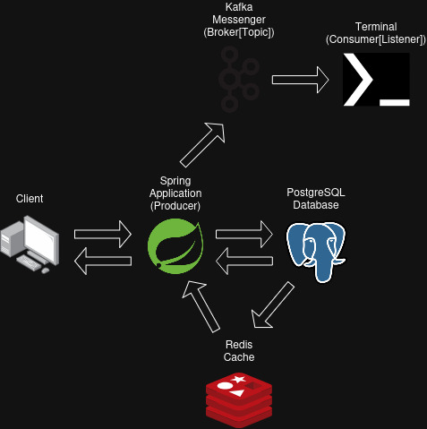
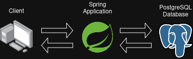

# System Design: main

# System Design: native

# 1. Spring Product

The Spring Product is a project that trains CRUD, REST, and GraphQL operations with Spring Boot, as well as testing, caching, and messaging.

# 2. Technologies

- Language: Java (25+)
- Dependency Manager: Maven (3.9.12+)
- Frameworks: Spring Boot with JPA/Hibernate (4.0.2+) & JUnit (6.0.2+)
- Library: Mockito (5.21.0+)
- Database: PostgreSQL (18.1+) with PgAdmin (4+)
- Cache: Redis (8.6.1+)
- REST API Client: Postman (11.83.2+)
- GraphQL API Client: GraphiQL (5.2.2+)
- Code Versioning: Git (2.53.0+)
- Messenger: Kafka (4.1.1+)
- Native Compilation: GraalVM (25+)
- Containerization: Docker (29.2.1+)
- CI: GitHub Actions

# 3. Clone the Repository

- Bash

`git clone https://github.com/jose-techcode/Spring-Product`

# 4. Setting Environment Variable

Create a file called .env in the project root and add your database password:

`DB_PASSWORD=your_db_password`

This file should not be uploaded to GitHub, as it contains sensitive information. Therefore, it should be included in .gitignore.

# 5. Setting GraalVM (Branch: native)

- To clean up the target folder and compile the source code for target, run this command:

`mvn clean package`

- After you clean up the target and compile the source code for the target, do the native compilation:

`./mvnw -Pnative native:compile -DskipTests`

- Run the native version:

`./target/Spring-Product`

# 6. Contribution

Feel free to open Issues or submit Pull Requests.

# 7. License

This project is licensed under the AGPL license.

# 8. Notes

For PostgreSQL, Redis, and Kafka to work, you need to configure both on your machine or use docker-compose-jvm.yaml. To use the application without Redis and Kafka, use the branch native or docker-compose-native.yaml. This project don't use Spring Security. Much of this project is for learning purposes.